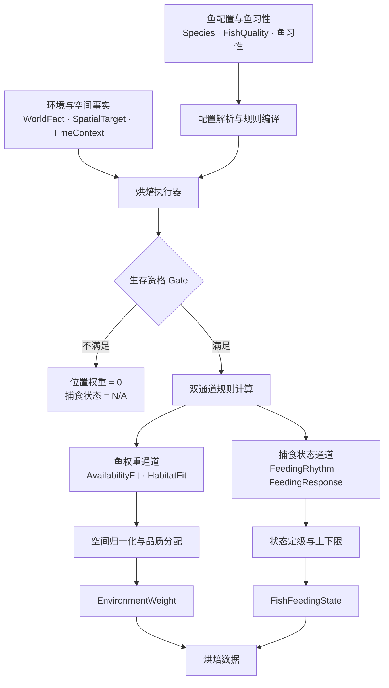
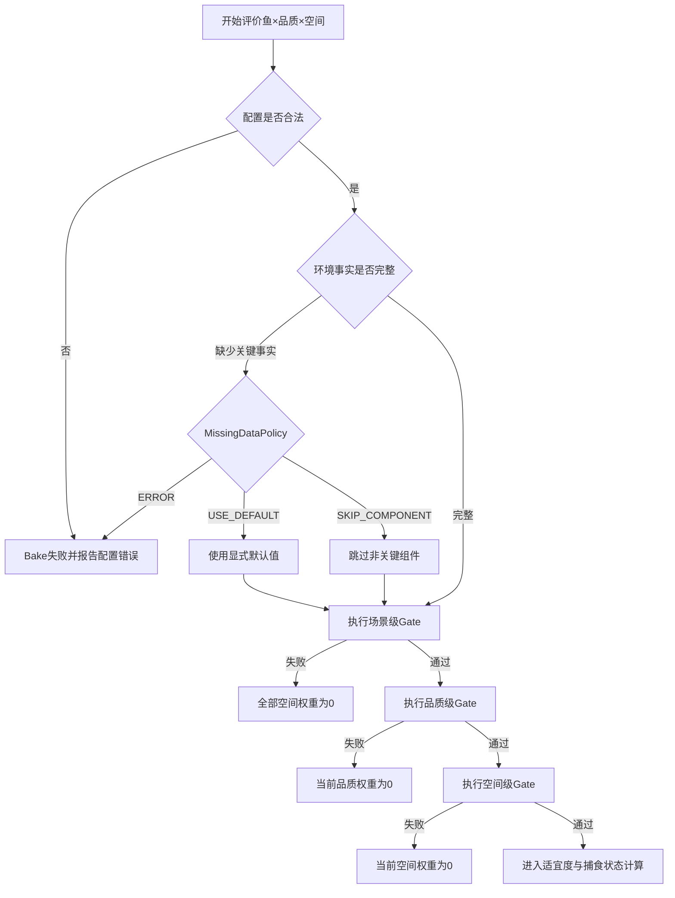
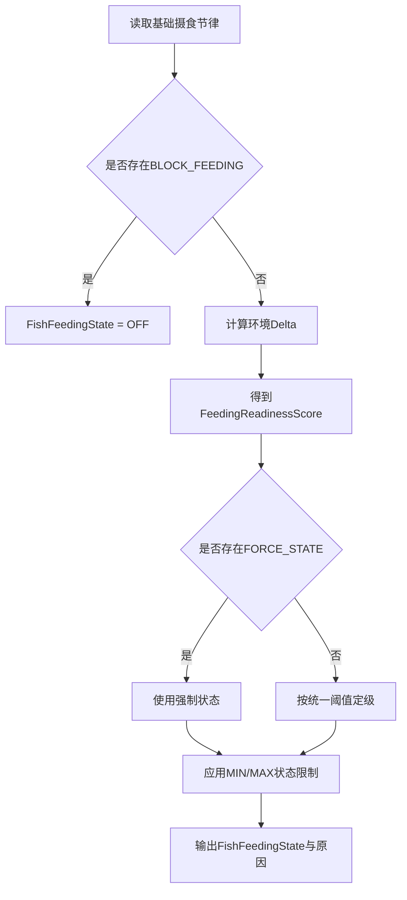
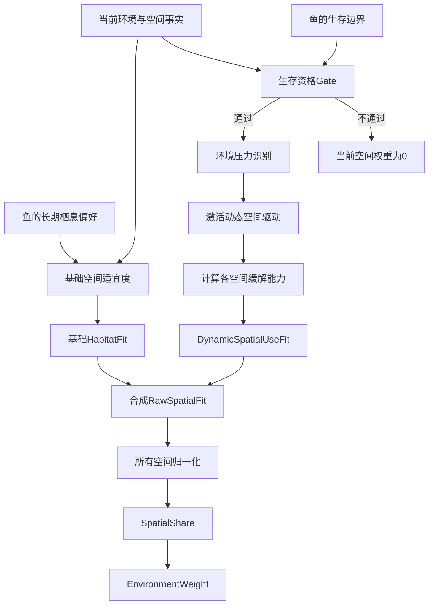
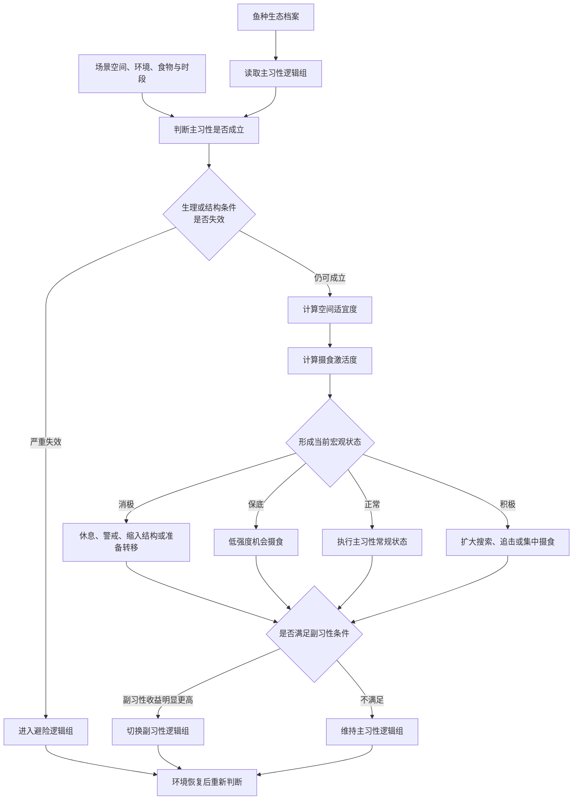
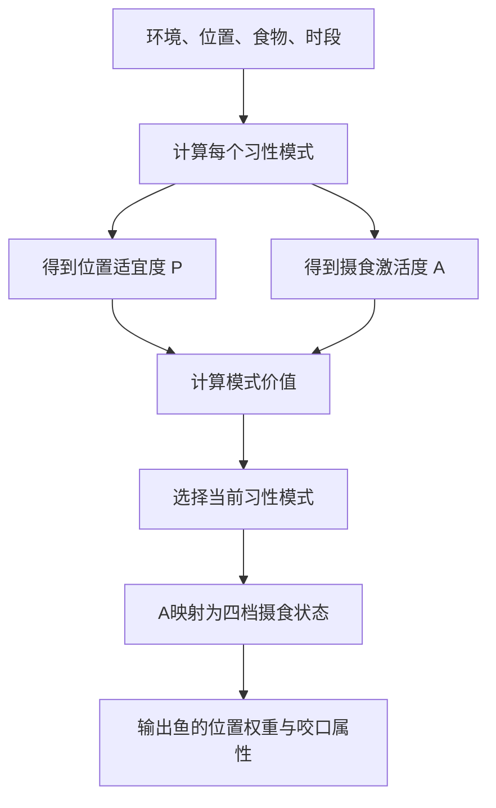
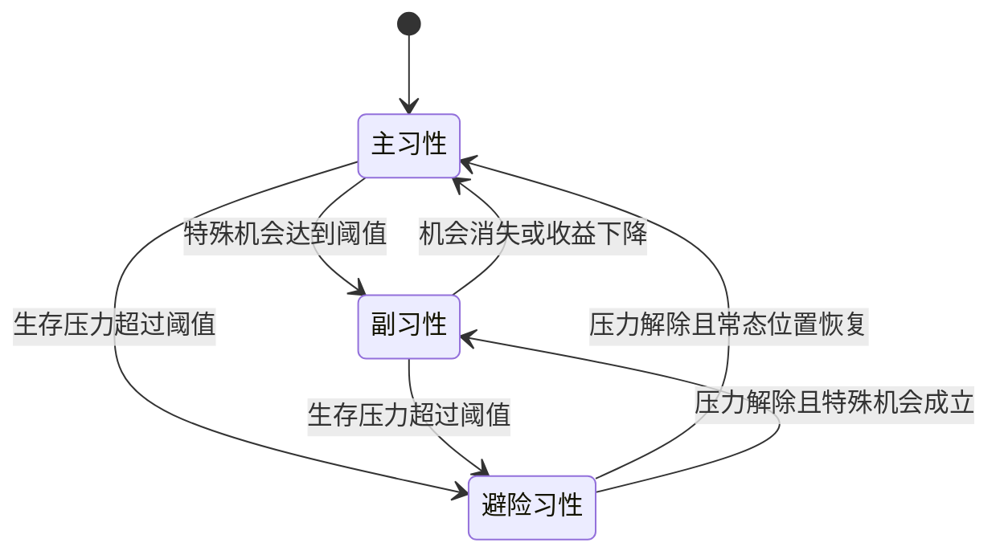
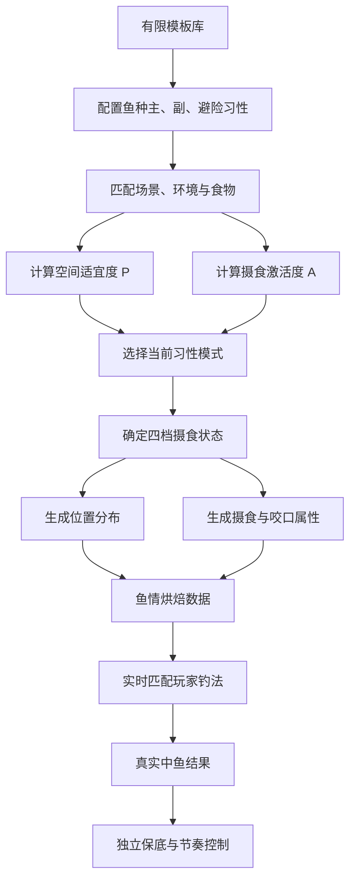

# 01 · 对话恢复与推导档案

> 来源：ChatGPT Work 共享对话《分支 · 分支 · 分支 · 中鱼策划案分析汇总》（2026-09-07 至 09-08，496 条消息，44 条用户发言，模型 gpt-5.6-sol-wm）。
> 本档案只做恢复，不做新设计。生产级下钻见 [02](02-Production架构设计.md)。
> 📎 阅读顺序：先看下方**速览节**（原对话最终交付物《固定鱼习性模型_系统流转图》，11 张流转图成图版，复制源码另存为 .html 打开），再看正文恢复档案；各阶段推导图（Mermaid）已内嵌于第二节对应位置。

---

## 速览｜《固定鱼习性模型_系统流转图》HTML 原件（先看速览，再看正文）

> 本文件是原对话的最终交付物，也是整个推导结果的**速览版**（自述"中鱼系统 V2 · 架构速览"；11 张流转图 + 侧边目录 + 打印样式）。本地仓库 [assets/固定鱼习性模型_系统流转图.html](assets/固定鱼习性模型_系统流转图.html) 同步保留。
> 注意：速览对应的是压缩模型的原始公式（胜者独占、P 算术平均、三因子连乘等）；生产级 R1.1 后的当前公式（四通道/幂归一/veto/AnglerMatch）见 [02 §四](02-Production架构设计.md)。

---

## 一、原始问题

用户（项目负责人视角）上传了策划新写的约 20 份文件（实为一份主文档《中鱼机制 0.3.4｜逻辑框架升级》+ 流程图/模块图/编辑器示意图 + 重复版本），要求：

1. 分析汇总策划的总思路：需要什么、产出什么、如何运行、解决什么问题；
2. 随后逐步演化为：校验用户自己的理解 → 确定 DSL 研发边界 → 确定制作优先级（P0/P1/P2）→ 产出团队共识 HTML → 分析策划的第二批文档（参数—计算机制 / DSL速览）→ 补齐外层权重模型与规则治理 → 建立科学鱼习性框架 → 最终压缩为「固定鱼习性模型」。

业务背景：钓鱼游戏的中鱼（咬钩命中）系统改造。旧系统是 `基础权重 × 系数1 × 系2 × …` 的连乘 + 服务端圆桌抽鱼。目标是让大量鱼种可低成本生产、同种鱼在不同环境/位置/时段产生可配置可解释的差异。

---

## 二、推导路径（按阶段）

### 阶段 1：策划文档分析（#33）
- 策划方案 = 保留旧「预计算—实时计算—服务端圆桌」底盘，在圆桌之前加规则层。
- 五个核心对象：Species / FishQuality / FishGroup / FishMode / FishCondition；核心结构是 FishQuality × FishGroup 正交，候选单位 = 品质 × 习性群。
- 公式：`SelectionWeight = EnvironmentWeight × Response`，复杂性收进两个因子内部而非叠乘数。
- 明确指出七项"尚未解决"：鱼情体验目标缺失、环境数据管线未建、规则库内容未填、全场鱼情调度缺失、保底与圆桌兼容未闭合、鱼情 APP 推荐未定义、（以及）验证闭环未建。

### 阶段 2：用户理解校验（#38–#43）
用户提出六步理解（编辑器→100 参数+分群 DSL→烘焙→进版→实时判定→生成鱼/鱼 AI）。修正三处：
- DSL 不替代系数，而是**组织系数**（参数提供事实，DSL 决定怎么算）；
- 动态参数是烘焙结果而非鱼配置；
- 分群 DSL 只产生 FishGroup，FishGroup 引用 FishMode；烘焙产物是 EnvironmentWeight + FishCondition + FishModeRef，不是"钓法 DSL"（钓法 DSL 是预编译资产）。

### 阶段 3：分群的必要性辨析（#44–#54）
- FishGroup=身份/大状态，FishMode=逻辑模式，FishCondition=数值状态，三者不可互替。
- 判据：「同一批鱼因环境不同而表现不同→不分群（用 FishCondition）；同一环境下同时存在不同身份、独立占比的多批鱼→才分群」。
- 环境致差异 / 个体随机 / 群体身份 三层分流。

### 阶段 4：优先级收敛（#55–#61）
用户拍板：分群降到 P2。P0 只替换 EnvironmentWeight 生成方式（保留旧饵/手法适配、NONE、圆桌）；P1 加 FishCondition + Presentation + Response；P2 加 FishGroup。P0 验收=新规则可替代现有算法且可控可解释可验证。

### 阶段 5：共识 HTML 迭代（#62–#230）
多轮 HTML：速览/详细版 → 按运行时间线重组 → 明确「编辑器生产配置与 DSL，规则系统执行 DSL」的生产链 → 收敛模块目标为两项：**鱼权重判定 + 鱼攻击状态判定**，一期做权重、二期做攻击状态 → 研发计划独立成章。

### 阶段 6：策划第二批文档分析（#231–#251）
策划两份新文档定义了执行内核：`Fish × Context × Target → Resolver → Bake Executor → DSL Evaluator → SpatialDistributionWeight`（未归一化）。
发现的关键问题：
- **两文档输出契约矛盾**：`weight = 2,510,100`（基础权重进 DSL）vs `weight = 1.0`（纯空间适宜度）；
- 建议拆为：`BaseOpportunityWeight / AvailabilityFit / SpatialFit / SpatialShare / QualityShare → EnvironmentWeight`；
- 「饵点水温」概念错位（烘焙期无玩家饵，应为 TargetWaterTemperature）；水温 Lerp 只是 V0 近似；
- StructureType 单枚举丢信息 → StructureTags[]；FeedingLayer（生态语义）与 Depth（物理）分离；
- 该 DSL 实为小型编程语言，研发/维护成本高；短期无编辑器意味着策划要手写代码；
- 「每条鱼自由写程序」不可规模生产 → Program Template；
- FishMode 名词冲突（策划用作 Program Binding）→ 建议 WeightProgramProfile/SpatialRuleTemplate；
- Editor 不应全部后置，至少要配置器 MVP + 预览。

### 阶段 7：用户三疑问 → 规则治理三缺失（#252–#257）
用户提出：①环境影响权重应有固定模板→算法集合；②需要限定运算框架否则新规则破坏旧规则；③鱼与环境因素拆解不足否则新元素无处安放。
全部判定成立，补齐：
- **三层算法体系**：RulePrimitive（lookup/range_fit/curve/clamp/if/return）→ HabitComponent（温度适宜度等）→ RuleTemplate（底栖型/伏击型等）；8 类算法：范围适宜/离散亲和/单峰偏好/阈值门槛/分段响应/相对重分配/窗口触发/叠加修正。
- **固定运算阶段**：环境事实解析→资格 Gate→总体可用度→空间适宜度→归一化→品质份额→最终合成→保护与追踪；每条规则必须登记六件事（阶段/输入/输出通道/合并方式/范围/冲突规则）。
- **六域因素分类**：FishTrait / WorldFact / SpatialTarget / FishCondition / PresentationSignals / ControlModifier；因素—算法—输出归属表；防重复生效（下雨→光照/浑浊/溶氧事实，鱼各自响应，禁止再乘"天气系数"）。

### 阶段 8：用户手绘结构图校验（#258–#299）
- 结构语义（GRASS_EDGE 等玩法标签）与结构属性（遮蔽/流速/含氧等数值）两层并存，职责不同；
- 「舒适/安全/觅食」升级为三通道：SurvivalEligibility / HabitatFit / FeedingOpportunityFit；
- 体型分布（FishQuality）与状态分布（FishCondition）不可混；
- 场景总量限制（Min/MaxSupply）与空间守恒（Σ SpatialShare=1）是两件事；
- 攻击状态输入拆三类：FishCondition / AttackHabit / PresentationSignals；
- 「深坑偏好震动」应建模为因果链：EffectiveSignal = PresentationSignal × EnvironmentTransmission × FishSensoryAbility。
> 📊 原对话图示｜完整系统结构（阶段 9 定稿，#299）（保留时点原貌，不代表当前公式）：

推导中期的完整系统图：双通道 + 归一化 + 状态定级的骨架在这时定型。

> 与生产级差异：AvailabilityFit → 独立 SUPPLY 通道；HabitatFit → 三层聚合（D3）；FishFeedingState → 连续 A + 四态投影（D5）；模式结构（份额混合）本图尚未出现。

### 阶段 9：完整系统结构定稿（#305–#313）
- 鱼侧六类配置：SpeciesConfig / FishQuality / SurvivalConstraint / HabitatPreference / AvailabilityResponse / FeedingHabit；
- 环境三类事实：TimeContext / WorldFact / SpatialTarget（多维属性集）；
- 八域习性库：Survival / Structure / Spatial / Environment / Availability / FeedingRhythm / Attack / QualityOverride；
- 模板三层：生态原型 × 摄食节律 × 复杂度（S/M/L）；
- HabitComponent 标准结构（15 字段含 Owner/Stage/OutputChannel/Range/Combine/Priority/Conflict/MissingDataPolicy/Fallback/Trace）；
- 烘焙遍历：Scene→Date→TimeSlice→Species→Quality→Target，场景级先算一次；
- 生存资格三层：SceneEligibility / QualityEligibility / TargetEligibility，MissingDataPolicy 显式；
- Fit 聚合分三类：决定性 Gate → 核心适宜度（加权几何平均）→ 次级修正（clamp 0.7–1.3）——防组件增多导致全图通缩；
- 捕食状态：基础节律 + 硬规则（BLOCK/FORCE/MIN/MAX）+ 环境增量 + 统一阈值定级 OFF/LOW/NORMAL/HIGH；
- 权重与状态互不读取（防重复）；同一因素多通道须分别定义。
> 📊 原对话图示｜生存资格完整分支（阶段 9，#313）（保留时点原貌，不代表当前公式）：

三层 Gate + MissingDataPolicy 的分支逻辑，基本原样进入 04 §四异常表。

> 📊 原对话图示｜捕食状态完整分支（阶段 9，#313）（保留时点原貌，不代表当前公式）：

BLOCK/FORCE/MIN/MAX 硬规则层——压缩成 (P,A) 时丢失，R1.1 由 F2 veto 包络部分恢复。

> 与生产级差异：定级阈值 → 连续 A 投影（D5）；BLOCK/MAX → F2 的 `AFIT_CAP` veto 连乘（结构化恢复，非可选纪律）。

### 阶段 10：动态空间利用补洞（#314–#320）
用户指出漏洞：「鱼能在很多结构生存，但当前环境决定它在哪——缺氧浮水、天热去阴」。补上 DynamicSpatialUse 层：
- 三种空间概念：EligibleHabitat（能不能在）/ BaseHabitatDistribution（平时在哪）/ DynamicSpatialUse（现在往哪集中）；
- 新习性域 DynamicSpatialResponseHabit（10 类驱动：缺氧/高温/低温/强光/弱光/强流/浑水/食物/水位/钓压）；
- 两步机制：EnvironmentalPressure（连续 0–1 压力）→ TargetReliefFit（各位置缓解能力）；
- `DynamicFit = lerp(1, Relief, Pressure)`，`RawSpatialFit = BaseHabitatFit × CriticalResponseFit × DominantDynamicFit × SecondaryModifier`；
- 多驱动优先级：生存危机＞生理压力＞栖息舒适＞觅食机会＞普通偏好；主驱动 + 次级限幅修正。
> 📊 原对话图示｜动态空间利用（阶段 10 补洞，#320）（保留时点原貌，不代表当前公式）：

用户指出"缺氧浮水/天热去阴"漏洞后的修正图：压力 → 缓解 → 合成 → 归一化。

> 与生产级对应：两步机制原样保留——落为 `derived.*StressBase`（管线预计算）+ `RELIEF` matcher（comfort 层）。

### 阶段 11：四步公式与 DSL 边界（#321–#331，#332–#348）
- 四步：0 生存 Gate → 1 BaseHabitatFit → 2 环境修正合成 RawSpatialFit → 3 全空间归一化 SpatialShare → 4 鱼种当前总权重（BaseOpportunityWeight × AvailabilityFit）分配到位置；
- 场景级环境影响（总量）与位置级环境影响（分布）必须分开；
- **DSL 使用边界定论**：遍历/Resolve/普通 Gate/基础查表/归一化/品质分配/最终合成——都不需要 DSL（固定框架）；需要 DSL 的只有：复合生存条件、条件启用、动态空间响应、特殊窗口、状态升降级/优先级；
- 归一化不是策划文档原文，是为闭合「未归一化输出 + Dynamic Spatial Use 不拥有 Species Supply」两前提而推导的补充方案；并指出须按空间容量（面积/可钓点/承载量）加权归一化，否则地图切得越碎的结构凭空获得越多鱼量。

### 阶段 12：DSL 复杂度分级（#380–#388）
穷举判断形态而非鱼种，得九类逻辑：直接查表/连续范围/单调响应/硬 Gate/条件启用/多因素交叉/动态空间响应/优先级覆盖限制/时间持续与迟滞。
- 关键发现：策划三例（底栖/溪流鳟/普通 Bass）不需要三套程序，只是启用的组件不同（LayerHardGate vs FlowTypeHardGate vs 无硬 Gate）；
- DSL 四级：L0 纯配置 / L1 条件规则 / L2 流程编排（≈策划当前 DSL）/ L3 完整脚本；
- 结论：现有业务证据只支持 L1；建议用规则穷举表验证后再考虑升级。

### 阶段 13：科学鱼习性框架（#389–#397）
完全退出实现，按生态学建模：九维生态档案（生理生态位/基础空间生态位/结构与流态/移动聚集/食物生态位/捕食方式/感知/活动节律/环境触发响应）＋修正维度（生长/繁殖/个体/种群/捕捞学习）；12 个生态原型表；因果链「外部事件→水体变化→生理/食物变化→位置变化→摄食状态变化」；攻击原因包含非摄食性（护巢/领域/反射/好奇）。

### 阶段 14：以「食物获取—空间利用策略」为原型核心（#398–#423）
用户洞察：捕食方式受结构偏好、环境、钓法综合影响，是从钓鱼视角归纳鱼的最佳角度。修正为「食物获取—空间利用策略」。
- 原型 = 食物所在空间＋位置载体＋获取方式＋空间移动＋攻击投入，再加感知/环境/节律/生命周期修正；
- **八种条件组合关系**：前置约束/共同满足/因果依赖/条件修正/状态切换/权衡折中/协同对冲/优先级覆盖；
- 动机优先级：生存压力＞繁殖任务＞避险需求＞摄食需求＞常规位置偏好。

### 阶段 15：习性逻辑组（#424–#431）
用户提出：主习性逻辑组 = 空间属性＋捕食属性＋环境适宜＋细分状态；环境判定得消极/保底/正常/积极四档，可触发细分状态、切副习性、或进避险。
两处修正：
- 原 12 原型混层：8 个核心原型可作主习性；深水冷水型/夜行感知型/洄游型/广适型是**修正包**不是平级原型；
- 环境适宜必须拆成**空间适宜度 P** 与**摄食激活度 A**两个结果（否则解释不了"鱼在不吃"与"位置一般但特定钓法能激活"）。
- 切换边界：核心空间策略+食物获取方式不变→只切细分状态；都变→切副习性；目标是生存→避险。主习性惯性防抖。
> 📊 原对话图示｜习性逻辑组大流转（阶段 15，#431）（保留时点原貌，不代表当前公式）：

压缩前的"重结构"版本：四态从 P 与 A 组合产生、副习性切换、避险覆盖。

> 与生产级差异："保底"更名"机会摄食"（阶段 19）；四态改由连续 A 投影（D5）；"切换"改为份额混合 + FORCE_SHARE 钉扎（D1）。

### 阶段 16：聚合压缩 → 固定鱼习性模型（#432–#438）
用户：还是太复杂，要一个「所有鱼通过配置+条件即可生成」的运算模型。压缩为：
- `鱼 = 基础属性 + 习性模式集合`，`HabitMode = 空间模板 + 摄食模板 + 条件模板`；
- 每鱼 1 主模式 + 0–N 副模式 + 1 避险模式，**同一数据结构**，只差优先级/条件/输出；
- 条件模板只输出 P 和 A；四档状态全体鱼统一，由 A 产生，经不同摄食模板表现不同；
- `模式价值 Vm = 优先级 × P × A`，取最大者为当前模式；
- `位置权重 = 基础投放权重 × 当前模式 P × 状态位置修正`，场景内归一化分配；
- 夜行/冷水/洄游/广适全部变成模式条件，不再是独立鱼类型。
> 📊 原对话图示｜聚合后统一运算（阶段 16，#438）（保留时点原貌，不代表当前公式）：

压缩成 HabitMode 三模板后的第一个统一流程——模式价值公式在这时引入。

> 与生产级差异：`Vm = P × A` 的循环依赖已由 D2 的 Scope/P 拆分解决；"选择"（胜者独占）已由 D1 份额混合替代；P 已三层聚合（D3）、A 已 veto 包络（F2）。

### 阶段 17：模板封装与三级继承（#439–#445）
- 模板结构固定（空间模式/摄食模式/条件模式/状态响应），预设库可扩展；
- `鱼种习性 = 核心原型 × 修正包 + 鱼种差异参数 + 条件性副习性`；
- 三级继承：核心原型模板 → 鱼类家族模板 → 具体鱼种（+地图投放）。

### 阶段 18：与 DSL 方案对比（#446–#451）
结论：习性模式模板更易理解/配置/验证，研发难度显著更低。研发复杂度比：固定模型 1 / 固定+L1 1.5–2 / L2 DSL 3–5 / 完整脚本 5+。DSL 的各项能力被固定结构吸收（对照表）。折中：90–95% 鱼用模板，少量特殊条件用 L1 结构化规则，保留受限扩展接口。**「模型优先，模板驱动，规则补充，DSL 兜底」**。

### 阶段 19：最终架构文档与流转图（#452–#495）
- 四态改名：**抑制 / 机会摄食 / 正常摄食 / 积极摄食**（避免与游戏"保底"混淆）；
- 公式族：Gate 连乘；`P = Gate × Σ(wᵢSᵢ)/Σwᵢ`；`A = Clamp(A_base + Σ wⱼRⱼ, 0, 1)`；状态阈值 0–0.25/0.45/0.75；模式选择固定优先级（避险＞强制生命周期＞触发副习性＞主习性）+ 切换分与惯性；`RawWeight = BaseWeight × P × StatePositionModifier` 归一化分配；`BiteScore = PositionWeight × ActivityModifier × BaitMatch × PresentationMatch × DistanceMatch`；
- 输出 FishHabitResult（含 ReasonTrace），供实时中鱼/鱼情 APP/验证工具；
- L1 残留能力：AND/OR/NOT、区间、启停模式、调 P/A、状态上下限、强制避险；不开放：任意改公共 Weight、自由顺序、局部变量、读其他规则中间结果、自定义流程；
- 产出 HTML《固定鱼习性模型_系统流转图》。
> 📊 原对话图示｜主/副/避险切换（阶段 19，#467）（保留时点原貌，不代表当前公式）：

阈值切换语义的原始状态图。

> 与生产级差异：离散切换已被 D1 连续份额替代（避险 = Scope 随压力连续上升 + Gate 硬清零；生命周期 = FORCE_SHARE 钉扎）。本图语义保留为 winnerTakeAll 回退开关的规格。

> 📊 原对话图示｜最终系统骨架（阶段 19，#467 一图版）（保留时点原貌，不代表当前公式）：

原对话最终结论图（成图版即已找回的 HTML 原件第 11 图）。

> 与生产级差异（R1.1 后的当前公式见 [02 §四](02-Production架构设计.md)）：P/A 双通道已扩为四通道（SUPPLY/SCOPE/PFIT/AFIT）；"选择模式"已改份额幂归一；实时端三 Match 已合成 AnglerMatch；其余骨架（模板库→配置→烘焙→实时→独立保底）不变。

---

## 三、关键中间结论（本仓库继承的遗产）

1. **双通道分离**：「鱼在哪里有多少」(P/位置) 与「鱼想不想吃」(A/状态) 是两个独立结果，只在最终 SelectionWeight 汇合一次。
2. **场景守恒与归一化**：位置权重必须归一化（Σ share = 1），鱼种总量由外层控制；环境变化表现为迁移而非全场同涨；归一化须按空间容量加权。
3. **场景级 vs 位置级环境影响分离**：总量（Availability/Supply）与分布（Spatial）是两类效应，公式上分开。
4. **通道纪律防重复计算**：同一环境事实可进多个通道（如溶氧：生存 Gate / 空间驱动 / 摄食修正），但每通道只能算一次且必须分别登记；禁止"天气直乘系数"这类总系数。
5. **固定运算框架优先于 DSL**：遍历、归一化、品质分配、最终合成永远是框架代码；DSL/条件只做条件、分支、启用、优先级、有限修正。
6. **硬 Gate 与软适宜度分层**：不能把"不喜欢"写成 Early Return；Gate 只管"不能生存/不能到达"。
7. **三层聚合防通缩**：Gate × 核心几何平均 × 限幅修正，新增组件不会天然压低所有旧鱼。
8. **动态空间利用两步机制**：压力（连续）→ 缓解能力（逐位置）→ lerp 合成；多驱动分主次。
9. **模板化生产**：鱼 = 有限模板组合 + 少量参数差异；策划建模不编程。
10. **Evaluator 只读快照**：不查表、不跨表 JOIN、无隐藏全局变量；确定性、可单测、可回放。
11. **Provenance / Trace / Replay / 版本三联**（Config/Rule/Environment Revision）贯穿所有产物。
12. **MissingDataPolicy 显式**：缺关键事实绝不静默按 1 处理。
13. **边界纪律**：中鱼系统输出到 Generate Fish/Fish AI 为止；追饵、攻击动作、Contact/Hook 不属于本系统。

---

## 四、被放弃 / 被修正的方案及原因

| # | 方案 | 出现阶段 | 放弃/修正原因 |
|---|---|---|---|
| 1 | 旧系统参数连乘（结构×温度×时段×饵…） | 起点 | 无法表达条件组合、优先级、短路、兜底；不可解释 |
| 2 | 完整 FishGroup / Group Routing / FishMode 体系 | 阶段 1–3 | 防止配置爆炸，且多数差异可由 FishCondition/环境规则表达；降为 P2。（生产级下钻中进一步被"模式份额"吸收，见 02 文档 D1） |
| 3 | 研发一门文本 DSL / L2 流程编排语言 | 阶段 6、12 | 实为小型编程语言；研发+维护+查错成本 3–6 倍；业务证据只支持 L1 条件规则 |
| 4 | 每条鱼自由编写不同程序 | 阶段 6 | 无法批量生产、无法调平、公共规则修改成本高 → Program Template |
| 5 | 「饵点水温」用玩家饵深参与烘焙 | 阶段 6 | 烘焙期无玩家；空间温度是环境事实，与玩家呈现分离 |
| 6 | 天气类型直接乘权重（LIGHT_RAIN → ×1.10） | 阶段 7 | 与天气引发的光照/浑浊/溶氧事实重复生效 |
| 7 | 舒适度 1–4 级作为唯一中间结果 | 阶段 8 | 精度损失、权重跳变、难归一化 → 连续 HabitatFit + 离散状态分离 |
| 8 | 把 Fish AI 行为状态当中鱼系统状态 | 阶段 8（GPT 一度犯错 #279） | 捕食状态是烘焙产出的鱼情大状态，不是追饵/攻击动作 |
| 9 | 动态空间直接写「天热→去深水」 | 阶段 10 | 因果不成立；须拆成压力 × 各位置缓解能力 |
| 10 | 组件 Fit 无限连乘 | 阶段 9 | 组件增多导致全图通缩 → 三层聚合 |
| 11 | 12 个生态原型平级并列 | 阶段 15 | 混层：深水冷水型等不含"怎么吃"，只能作修正包 |
| 12 | 四档状态名「消极/保底」 | 阶段 15→19 | 与游戏保底机制混淆 → 抑制/机会摄食 |
| 13 | 单一总"环境适宜度"直接出四态 | 阶段 15 | 解释不了"鱼在不吃"与"位置一般但能被激活" → 拆 P/A |
| 14 | （压缩模型内部）P 加权算术平均 | 阶段 19 | 生产级判定为回退：稀释必需要素 → 恢复三层聚合（02 文档 D3） |
| 15 | （压缩模型内部）胜者独占模式选择 | 阶段 16 | 生产级判定：阈值抖动 + 无法表达多群体并存（02 文档 D1） |
| 16 | （压缩模型内部）运行时多级模板继承 | 阶段 17 | 生产级判定：菱形继承/合并顺序歧义 → 模板即宏（02 文档 D4） |

> 注：#14–#16 是本次生产级下钻新增的推翻项，不属于原对话内容，详见 02。

---

## 五、当前框架为何形成（驱动因素）

1. **生产可行性**：几百条鱼不能靠手写 DSL/逐鱼配几十参数；有限模板 × 修正 × 参数差异是唯一可规模化的路径。
2. **策划心智模型**：填生态档案（在哪/怎么吃/何时成立/表现如何）远比写程序接近策划的思维方式；AI 辅助生成结构化配置也因此可行。
3. **研发成本比**：固定计算器（1）vs L1（1.5–2）vs L2 DSL（3–5）vs 脚本（5+），且后期查错成本差更大。
4. **可验证性**：结构固定 → 可批量模拟、可解释（P/A/份额/原因）、可回放、可新旧对比。
5. **可扩展性**：新因素 = 新条件行登记到指定通道，不触碰框架；模板库可增预设而不改底层。
6. **渐进落地**：P0 只换 EnvironmentWeight，旧圆桌/饵手法适配/NONE 不动，风险可控。

---

## 六、仍未验证的假设（原对话遗留 + 生产级新增）

| # | 假设 | 来源 | 验证方式 |
|---|---|---|---|
| 1 | ~95% 的鱼可用模板+L1 条件覆盖 | 阶段 18 的估算 | 规则穷举表：8 类代表鱼 × 10 种环境情景，统计 L0/L1/L2 占比（05 文档矩阵） |
| 2 | 场景鱼量守恒（归一化）符合设计意图 | 阶段 11 推导，策划未确认 | 设计确认：环境变好是否允许"总量增加"（已留 Supply 通道） |
| 3 | P/A 公式形态与状态阈值合理 | 阶段 19 自述"初始结构" | 模拟器参数扫描 + 体验目标反推 |
| 4 | 空间 Target 划分与容量数据可得 | 阶段 11 提出，管线未建 | 关卡编辑器打标试点：结构标签+面积/可钓点/水层带 |
| 5 | 逐位置环境事实（水温/溶氧/光照/食物密度场）可产出且更新成本可接受 | 阶段 1 已列为缺失 | 环境管线 V0（分层插值）实测 |
| 6 | 玩家呈现信号（速度/轨迹/停顿/姿态）提取质量足以支撑匹配项 | 阶段 1/13 提及 | 客户端信号采样回放抽检 |
| 7 | 避险/生命周期可"只是模式"而不需要独立轴 | 阶段 16 压缩 | 模拟极端场景（全场热应激、产卵季）份额行为是否可信 |
| 8 | 模式份额混合的体验手感（vs 胜者独占） | 生产级新增（D1） | A/B 模拟对比：份额曲线平滑度、热点迁移轨迹 |
| 9 | 7天×5时段（35 切片/周）的烘焙节奏与数据量可行 | 阶段 5 出现过"7天×5时段" | 烘焙管线实测（预算见 04） |
| 10 | 旧系统可按鱼种灰度切换（新旧 EnvironmentWeight 并存） | 阶段 4 假设 | 影子烘焙 + 双跑对比工具 |
| 11 | 「保底」等 ControlModifier 完全外置不进模型 | 阶段 19 明确 | 设计确认保底系统边界与接口 |
| 12 | 策划两文档的输出契约矛盾（2,510,100 vs 1.0）已按"DSL 只出 RawSpatialFit"解决 | 阶段 6/11 的三项对齐决策之一 | 与策划正式确认（另两项：DSL 自由度收紧、强制归一化） |

## 七、对齐状态与交付物缺口

- 原对话产出的 HTML：《固定鱼习性模型_系统流转图》**原件已找回**（用户提供，2026-09-10，存 [assets/固定鱼习性模型_系统流转图.html](assets/固定鱼习性模型_系统流转图.html)，含最终 11 张流转图的成图版）；其余 HTML（新版中鱼系统设计总结、方案文档、鱼习性框架摘要）仍缺；"十项待确认决策"具体条目仍未在对话正文中展开，需从上述原件找回后核对。
- 与策划文档的三个实质差异（DSL 输出契约、DSL 自由度、归一化强制性）在对话中给出建议但未见策划确认记录。
- 本分支 02 文档的 D1/D7（模式份额吸收 FishGroup、恢复体型轴）进一步改变了策划原文结构，必须与策划对齐后才能进入研发。
